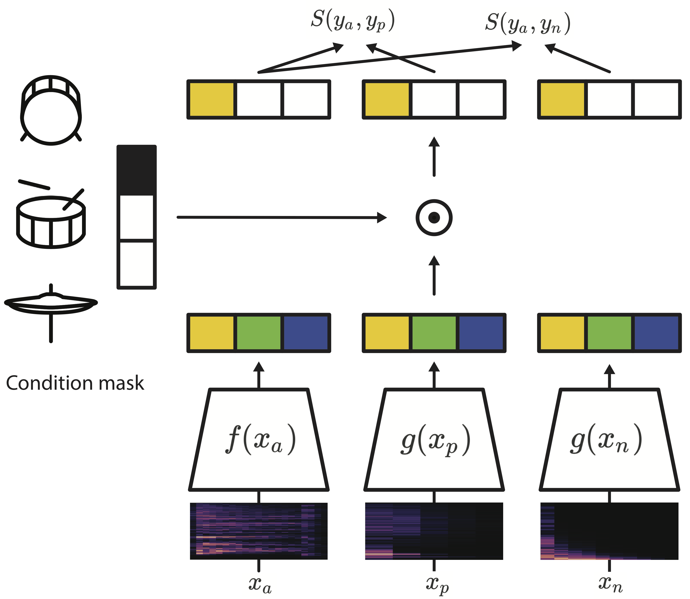

This Repository is an implementation repository for Conditional Drum Sample Retrieval from Mixed Audio Using Disentangled Audio Embedding. Wonil Kim, Kyungyun Lee and Juhan Nam


### Overview
<p align="justify">
Finding desired instrument samples is one of the most important tasks in sample-based music composition. However, searching through a large collection of samples is an obstacle to the creative activities. We present a method to conditionally retrieve different types of instrument samples from mixed audio as a query using disentangled audio embedding. We learn the disentangled audio embedding via cross-modality metric learning using conditional similarity networks. We conduct a variety of experiments and show that the model outperforms previous approaches in the query-by-example task. We also show through our user test that our proposed model is able to retrieve similar samples, which is comparable to human timbre perception. Finally, we visualize the disentangled embedding space and provide the insight into the effectiveness of applying a condition mask for each drum class.

</p>
<!-- <center>
{: width="50%" height="50%"}
</center> -->

<center></center>

<p align="center"> 
Overview of the proposed model. Given a mixed audio x_a and two monophonic drum samples (kick drum in this example), x_p and x_n, the two embedding functions, f(.) and g(.), are trained by applying a condition mask for the drum type to enforce the relevant information to be embedded in the drum sub-dimension.

</p>

### Dataset
<p align="justify">
We created a new dataset by synthesizing audio using kick, snare, hi-hat, and loop track. In the four classes, kick, snare, and hi-hat are one-shot (or single isolated) samples, and loop tracks are multi-instrument audio excluding drums. We collected samples with different tags such as 808, acoustic, beatbox, glitch, impact, and lofi, which are frequently used in pop, electronic and hip-hop music genres. In case of loop tracks, we collected data through Beatport, which provides stems of high-quality commercial songs. To diversify genres, we also utilize a publicly available dataset, MUSDB18, creating loop tracks by removing the drum tracks. We only use songs with a constant tempo which ranges from 67.5 to 126 BPM. As a result, a total of 2,000 kick, snare, and hi-hat one-shot samples, and 297 loop tracks are used in the experiment. We conducted experiments with 1,500 training samples, 100 validation samples, and 400 test samples for each drum class.
</p>

### Dataset samples

<script>
function pauseOthers(ele) {
    $("audio").not(ele).each(function (index, audio) {audio.pause();});
}
</script>

<style>
.main-content table {
    display: inline-table;
}
table {
    table-layout:fixed;
    width: 100%;
    overflow: hidden;
}
#player{
    width: 100%;
}
</style>

<table>
    <tr>
        <th> Category </th>
        <th> Kick </th>
        <th> Snare </th>
        <th> Hi-hat </th>
    </tr>
    <tr>
        <th> 808 </th>
        <th> <audio controls id="player" onplay="pauseOthers(this);"><source src="assets/audios/808/sample1.wav" type="audio/mpeg"></audio> </th>
        <th> <audio controls id="player" onplay="pauseOthers(this);"><source src="assets/audios/808/sample2.wav" type="audio/mpeg"></audio> </th>
        <th> <audio controls id="player" onplay="pauseOthers(this);"><source src="assets/audios/808/sample3.wav" type="audio/mpeg"></audio> </th>
    </tr>
    <tr>
        <th> Acoustic </th>
        <th> <audio controls id="player" onplay="pauseOthers(this);"><source src="assets/audios/Acoustic/sample1.wav" type="audio/mpeg"></audio> </th>
        <th> <audio controls id="player" onplay="pauseOthers(this);"><source src="assets/audios/Acoustic/sample2.wav" type="audio/mpeg"></audio> </th>
        <th> <audio controls id="player" onplay="pauseOthers(this);"><source src="assets/audios/Acoustic/sample3.wav" type="audio/mpeg"></audio> </th>
    </tr>
    <tr>
        <th> Beatbox </th>
        <th> <audio controls id="player" onplay="pauseOthers(this);"><source src="assets/audios/Beatbox/sample1.wav" type="audio/mpeg"></audio> </th>
        <th> <audio controls id="player" onplay="pauseOthers(this);"><source src="assets/audios/Beatbox/sample2.wav" type="audio/mpeg"></audio> </th>
        <th> <audio controls id="player" onplay="pauseOthers(this);"><source src="assets/audios/Beatbox/sample3.wav" type="audio/mpeg"></audio> </th>
    </tr>
    <tr>
        <th> Glitch </th>
        <th> <audio controls id="player" onplay="pauseOthers(this);"><source src="assets/audios/Glitch/sample1.wav" type="audio/mpeg"></audio> </th>
        <th> <audio controls id="player" onplay="pauseOthers(this);"><source src="assets/audios/Glitch/sample2.wav" type="audio/mpeg"></audio> </th>
        <th> <audio controls id="player" onplay="pauseOthers(this);"><source src="assets/audios/Glitch/sample3.wav" type="audio/mpeg"></audio> </th>
    </tr>
    <tr>
        <th> lofi </th>
        <th> <audio controls id="player" onplay="pauseOthers(this);"><source src="assets/audios/lofi/sample1.wav" type="audio/mpeg"></audio> </th>
        <th> <audio controls id="player" onplay="pauseOthers(this);"><source src="assets/audios/lofi/sample2.wav" type="audio/mpeg"></audio> </th>
        <th> <audio controls id="player" onplay="pauseOthers(this);"><source src="assets/audios/lofi/sample3.wav" type="audio/mpeg"></audio> </th>
    </tr>
    <tr>
        <th> Vintage </th>
        <th> <audio controls id="player" onplay="pauseOthers(this);"><source src="assets/audios/Vintage/sample1.wav" type="audio/mpeg"></audio> </th>
        <th> <audio controls id="player" onplay="pauseOthers(this);"><source src="assets/audios/Vintage/sample2.wav" type="audio/mpeg"></audio> </th>
        <th> <audio controls id="player" onplay="pauseOthers(this);"><source src="assets/audios/Vintage/sample3.wav" type="audio/mpeg"></audio> </th>
    </tr>
    <tr>
        <th> Wet </th>
        <th> <audio controls id="player" onplay="pauseOthers(this);"><source src="assets/audios/Wet/sample1.wav" type="audio/mpeg"></audio> </th>
        <th> <audio controls id="player" onplay="pauseOthers(this);"><source src="assets/audios/Wet/sample2.wav" type="audio/mpeg"></audio> </th>
        <th> <audio controls id="player" onplay="pauseOthers(this);"><source src="assets/audios/Wet/sample3.wav" type="audio/mpeg"></audio> </th>
    </tr>
</table>

<table>
    <tr>
        <th>  </th>
        <th> Beatport </th>
        <th> MuseDB18 </th>
        <th> reFx </th>
    </tr>
    <tr>
        <th> Loop track </th>
        <th> <audio controls id="player" onplay="pauseOthers(this);"><source src="assets/audios/Loop/Beatport.wav" type="audio/mpeg"></audio> </th>
        <th> <audio controls id="player" onplay="pauseOthers(this);"><source src="assets/audios/Loop/MuseDB18.wav" type="audio/mpeg"></audio> </th>
        <th> <audio controls id="player" onplay="pauseOthers(this);"><source src="assets/audios/Loop/reFx.wav" type="audio/mpeg"></audio> </th>
    </tr>
</table>

<table>
    <tr>
        <th>  </th>
        <th> Sample 1 </th>
        <th> Sample 2 </th>
        <th> Sample 3 </th>
    </tr>
    <tr>
        <th> Mixed Audio Sample </th>
        <th> <audio controls id="player" onplay="pauseOthers(this);"><source src="assets/audios/mixed/sample1.wav" type="audio/mpeg"></audio> </th>
        <th> <audio controls id="player" onplay="pauseOthers(this);"><source src="assets/audios/mixed/sample2.wav" type="audio/mpeg"></audio> </th>
        <th> <audio controls id="player" onplay="pauseOthers(this);"><source src="assets/audios/mixed/sample3.wav" type="audio/mpeg"></audio> </th>
    </tr>
</table>

### Quantitative Evaluation
<p align="justify">
We created a new dataset by synthesizing audio using kick, snare, hi-hat, and loop track. In the We evaluate the model through a query-by-example experiment, where the query is a mixed audio loop and targets are monophonic drum samples. This resembles the real-world scenario of sample searching during sample-based music composition. The distance between the query audio and the target audio set is computed with the Euclidean, and the retrieval result is listed in the nearest order. The target audio set consists of kick, snare, and hi-hat samples of various timbre, all of which are unseen data. In this experiment, a total of 1200 target data samples were used in the experiment, with 400 samples for each class. 

We conducted the query-by-example test using the tracks used in the user study. Since the query audios used for user study have sound quality similar to commercial songs, testing with these audios can verify whether the model is applicable to the real situation. Since the test set contains samples used to create the query audio, we can measure the accuracy with query-by-example. A total of 160 query audio are used in the experiment. 
</p>

<table>
    <tr>
        <th>  </th>
        <th> Mixed audio loop 1 </th>
        <th> Rank 1 </th>
        <th> Rank 2 </th>
        <th> Rank 3 </th>
    </tr>
    <tr>
        <th> Kick </th>
        <th> <audio controls id="player" onplay="pauseOthers(this);"><source src="assets/audios/result/1_mixed1.wav" type="audio/mpeg"></audio> </th>
        <th> <audio controls id="player" onplay="pauseOthers(this);"><source src="assets/audios/result/1_kick1.wav" type="audio/mpeg"></audio> </th>
        <th> <audio controls id="player" onplay="pauseOthers(this);"><source src="assets/audios/result/1_kick2.wav" type="audio/mpeg"></audio> </th>
        <th> <audio controls id="player" onplay="pauseOthers(this);"><source src="assets/audios/result/1_kick3.wav" type="audio/mpeg"></audio> </th>
    </tr>
        <tr>
        <th> Snare </th>
        <th> <audio controls id="player" onplay="pauseOthers(this);"><source src="assets/audios/result/1_mixed1.wav" type="audio/mpeg"></audio> </th>
        <th> <audio controls id="player" onplay="pauseOthers(this);"><source src="assets/audios/result/1_snare1.wav" type="audio/mpeg"></audio> </th>
        <th> <audio controls id="player" onplay="pauseOthers(this);"><source src="assets/audios/result/1_snare2.wav" type="audio/mpeg"></audio> </th>
        <th> <audio controls id="player" onplay="pauseOthers(this);"><source src="assets/audios/result/1_snare3.wav" type="audio/mpeg"></audio> </th>
    </tr>
        <tr>
        <th> Hi-hat </th>
        <th> <audio controls id="player" onplay="pauseOthers(this);"><source src="assets/audios/result/1_mixed1.wav" type="audio/mpeg"></audio> </th>
        <th> <audio controls id="player" onplay="pauseOthers(this);"><source src="assets/audios/result/1_hh1.wav" type="audio/mpeg"></audio> </th>
        <th> <audio controls id="player" onplay="pauseOthers(this);"><source src="assets/audios/result/1_hh2.wav" type="audio/mpeg"></audio> </th>
        <th> <audio controls id="player" onplay="pauseOthers(this);"><source src="assets/audios/result/1_hh3.wav" type="audio/mpeg"></audio> </th>
    </tr>
</table>

<table>
    <tr>
        <th>  </th>
        <th> Mixed audio loop 2 </th>
        <th> Rank 1 </th>
        <th> Rank 2 </th>
        <th> Rank 3 </th>
    </tr>
    <tr>
        <th> Kick </th>
        <th> <audio controls id="player" onplay="pauseOthers(this);"><source src="assets/audios/result/2_mixed1.wav" type="audio/mpeg"></audio> </th>
        <th> <audio controls id="player" onplay="pauseOthers(this);"><source src="assets/audios/result/2_kick1.wav" type="audio/mpeg"></audio> </th>
        <th> <audio controls id="player" onplay="pauseOthers(this);"><source src="assets/audios/result/2_kick2.wav" type="audio/mpeg"></audio> </th>
        <th> <audio controls id="player" onplay="pauseOthers(this);"><source src="assets/audios/result/2_kick3.wav" type="audio/mpeg"></audio> </th>
    </tr>
        <tr>
        <th> Snare </th>
        <th> <audio controls id="player" onplay="pauseOthers(this);"><source src="assets/audios/result/2_mixed1.wav" type="audio/mpeg"></audio> </th>
        <th> <audio controls id="player" onplay="pauseOthers(this);"><source src="assets/audios/result/2_snare1.wav" type="audio/mpeg"></audio> </th>
        <th> <audio controls id="player" onplay="pauseOthers(this);"><source src="assets/audios/result/2_snare2.wav" type="audio/mpeg"></audio> </th>
        <th> <audio controls id="player" onplay="pauseOthers(this);"><source src="assets/audios/result/2_snare3.wav" type="audio/mpeg"></audio> </th>
    </tr>
        <tr>
        <th> Hi-hat </th>
        <th> <audio controls id="player" onplay="pauseOthers(this);"><source src="assets/audios/result/2_mixed1.wav" type="audio/mpeg"></audio> </th>
        <th> <audio controls id="player" onplay="pauseOthers(this);"><source src="assets/audios/result/2_hh1.wav" type="audio/mpeg"></audio> </th>
        <th> <audio controls id="player" onplay="pauseOthers(this);"><source src="assets/audios/result/2_hh2.wav" type="audio/mpeg"></audio> </th>
        <th> <audio controls id="player" onplay="pauseOthers(this);"><source src="assets/audios/result/2_hh3.wav" type="audio/mpeg"></audio> </th>
    </tr>
</table>

<table>
    <tr>
        <th>  </th>
        <th> Mixed audio loop 3 </th>
        <th> Rank 1 </th>
        <th> Rank 2 </th>
        <th> Rank 3 </th>
    </tr>
    <tr>
        <th> Kick </th>
        <th> <audio controls id="player" onplay="pauseOthers(this);"><source src="assets/audios/result/100.0_5 test 000_Hats closed 151_Kick glitch 132_Snare clap 134.wav" type="audio/mpeg"></audio> </th>
        <th> <audio controls id="player" onplay="pauseOthers(this);"><source src="assets/audios/result/Kick glitch 132.wav" type="audio/mpeg"></audio> </th>
        <th> <audio controls id="player" onplay="pauseOthers(this);"><source src="assets/audios/result/Kick glitch 130.wav" type="audio/mpeg"></audio> </th>
        <th> <audio controls id="player" onplay="pauseOthers(this);"><source src="assets/audios/result/Kick glitch 142.wav" type="audio/mpeg"></audio> </th>
    </tr>
        <tr>
        <th> Snare </th>
        <th> <audio controls id="player" onplay="pauseOthers(this);"><source src="assets/audios/result/100.0_5 test 000_Hats closed 151_Kick glitch 132_Snare clap 134.wav" type="audio/mpeg"></audio> </th>
        <th> <audio controls id="player" onplay="pauseOthers(this);"><source src="assets/audios/result/Snare clap 134.wav" type="audio/mpeg"></audio> </th>
        <th> <audio controls id="player" onplay="pauseOthers(this);"><source src="assets/audios/result/Snare clap 151.wav" type="audio/mpeg"></audio> </th>
        <th> <audio controls id="player" onplay="pauseOthers(this);"><source src="assets/audios/result/Snare glitch 197.wav" type="audio/mpeg"></audio> </th>
    </tr>
        <tr>
        <th> Hi-hat </th>
        <th> <audio controls id="player" onplay="pauseOthers(this);"><source src="assets/audios/result/100.0_5 test 000_Hats closed 151_Kick glitch 132_Snare clap 134.wav" type="audio/mpeg"></audio> </th>
        <th> <audio controls id="player" onplay="pauseOthers(this);"><source src="assets/audios/result/Hats glitch 186.wav" type="audio/mpeg"></audio> </th>
        <th> <audio controls id="player" onplay="pauseOthers(this);"><source src="assets/audios/result/Hats urban 333.wav" type="audio/mpeg"></audio> </th>
        <th> <audio controls id="player" onplay="pauseOthers(this);"><source src="assets/audios/result/Hats 808 015.wav" type="audio/mpeg"></audio> </th>
    </tr>
</table>


# Header 1

This is a normal paragraph following a header. GitHub is a code hosting platform for version control and collaboration. It lets you and others work together on projects from anywhere.

## Header 2

> This is a blockquote following a header.
>
> When something is important enough, you do it even if the odds are not in your favor.

### Header 3

```js
// Javascript code with syntax highlighting.
var fun = function lang(l) {
  dateformat.i18n = require('./lang/' + l)
  return true;
}
```

```ruby
# Ruby code with syntax highlighting
GitHubPages::Dependencies.gems.each do |gem, version|
  s.add_dependency(gem, "= #{version}")
end
```

#### Header 4

*   This is an unordered list following a header.
*   This is an unordered list following a header.
*   This is an unordered list following a header.

##### Header 5

1.  This is an ordered list following a header.
2.  This is an ordered list following a header.
3.  This is an ordered list following a header.

###### Header 6

| head1        | head two          | three |
|:-------------|:------------------|:------|
| ok           | good swedish fish | nice  |
| out of stock | good and plenty   | nice  |
| ok           | good `oreos`      | hmm   |
| ok           | good `zoute` drop | yumm  |

### There's a horizontal rule below this.

* * *

### Here is an unordered list:

*   Item foo
*   Item bar
*   Item baz
*   Item zip

### And an ordered list:

1.  Item one
1.  Item two
1.  Item three
1.  Item four

### And a nested list:

- level 1 item
  - level 2 item
  - level 2 item
    - level 3 item
    - level 3 item
- level 1 item
  - level 2 item
  - level 2 item
  - level 2 item
- level 1 item
  - level 2 item
  - level 2 item
- level 1 item

### Small image


### Large image


### Definition lists can be used with HTML syntax.

<dl>
<dt>Name</dt>
<dd>Godzilla</dd>
<dt>Born</dt>
<dd>1952</dd>
<dt>Birthplace</dt>
<dd>Japan</dd>
<dt>Color</dt>
<dd>Green</dd>
</dl>

```
Long, single-line code blocks should not wrap. They should horizontally scroll if they are too long. This line should be long enough to demonstrate this.
```

```
The final element.
```
